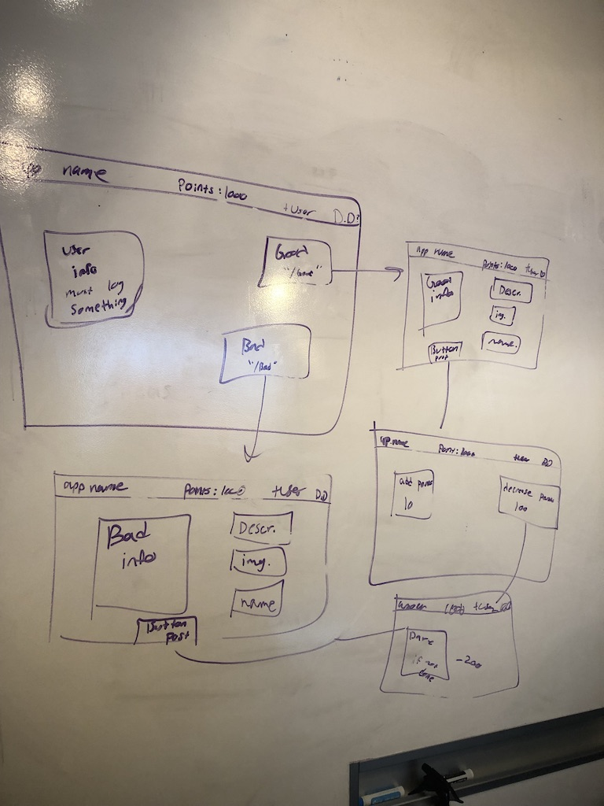
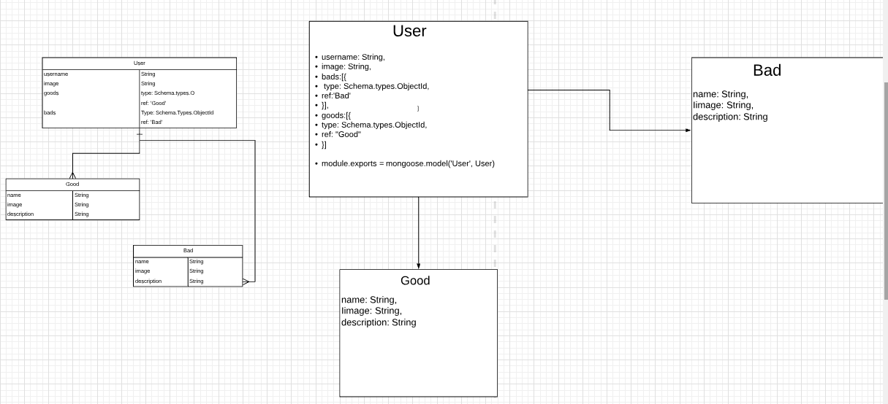

# project-2

# Overview:

For Project 2, I created an app where individual families can go and try to make themsleves better people as a unit. This app will allow them to add any good deeds they've done or even any bad deeds. This app is to help families self reflect what they look like as a team and people.

**Live Site:** [Heroku Deployed App](https://damp-anchorage-55469.herokuapp.com/)

## Technologies Used:
1. **Languages** - _HTML5, CSS3, Javascript, Node.js, Express.js, MongoDb, Mongoose_

2.**Design** - _BootStrap_

3.**Project Planning and User Stories** - [Trello](https://trello.com/b/ewYD9Z5h/project-2)

4.**Visual Studio Code**

## WireFrame:

## ERDs:

## Future Development:

1. Be able to add points: 10 points for good deeds but remove 100 points for bad deeds

2. Whenever you enter a bad deed a dare should be accompanied it, and if they dont do the dare with prove then they lose double the points 